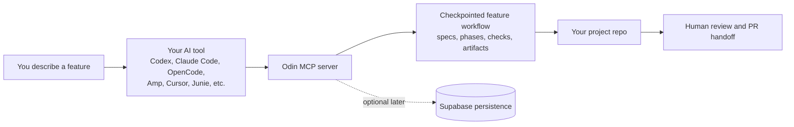

<p align="center">
  
</p>

<h1 align="center">Odin</h1>

<p align="center">
  <strong>Make AI-Assisted Development Reliable Before Code Is Written</strong>
</p>

<p align="center">
  
  
  
</p>

Odin helps AI coding agents stop guessing from loose prompts. It turns feature intent into an explicit workflow so requirements, phase checkpoints, implementation work, and review artifacts stay visible as work moves from idea to release.

Odin runs as one local MCP server named `odin` and plugs into tools you already use: Codex, Claude Code, OpenCode, Amp, Cursor, Junie, and similar AI coding environments.

## Why Odin

AI-assisted development often breaks down in the same way:

```text
idea -> prompt -> plausible code -> fix -> fix -> reconstruct intent
```

The problem is not only that specs are missing. It is that intent lives in chat history, readiness is implicit, and the agent can start building before the work is clear.

Odin makes the intended path explicit:

```text
idea -> spec -> refine -> build -> verify -> release
```

The core idea: AI does not reliably preserve intent on its own. Odin makes intent external, structured, and enforceable.

## What Odin Is

Odin is a specification-driven workflow layer for AI-assisted coding. It is not a replacement IDE, agent, or task tracker.

It gives your assistant a branch-first feature workflow with checkpoints that answer:

- What are we trying to build?
- Is the feature ready to implement?
- What phase are we in?
- What evidence did we produce?
- What still needs human judgment?

## Principles

- **Intent before implementation**: make the requirement explicit before code starts drifting.
- **Readiness over motion**: prefer a clear feature boundary over fast but premature code generation.
- **Feature first**: move one coherent feature through a workflow instead of scattering work across ad-hoc tasks.
- **Enforcement over suggestion**: phases, artifacts, checks, and gates should be explicit rather than hidden in prompt history.
- **Use the tools you already like**: Odin plugs into your existing AI tool instead of replacing it.
- **Keep the human at the right boundary**: AI should accelerate delivery, not erase judgment, review, or responsibility.

## What Odin Changes

- Your AI agent works from durable specs and phase artifacts instead of ad-hoc prompt history.
- Implementation starts from an explicit feature workflow, not just because an agent can write code.
- Specs, tasks, phase outputs, quality gates, review checks, phase-agent proof, skills used, and reusable learnings become explicit.
- Odin can persist workflow state, learnings, and release history when you are ready for Supabase.
- You keep your current AI tool. Odin plugs into it as an MCP server.

## Who This Is For

- **Using Odin in your own project**: start with the quickstart below.
- **Developing Odin itself**: use [docs/guides/DEVELOPING-ODIN.md](docs/guides/DEVELOPING-ODIN.md).

## How Odin Fits In



## Quick Start

Run the bootstrap command from the root of the project where you want Odin to live. This is one-time setup for each target project.

Important:
Odin writes `.odin/` into the directory you run this command from, unless you pass `--project-root` explicitly.

### Pick your tool

| Tool | Command | What happens |
|------|---------|--------------|
| **Codex** | `pnpm dlx @plazmodium/odin init --tool codex --write-mcp` | Writes `.codex/config.toml` for you |
| **OpenCode** | `pnpm dlx @plazmodium/odin init --tool opencode --write-mcp` | Writes `opencode.json` for you |
| **Claude Code** | `pnpm dlx @plazmodium/odin init --tool claude-code --write-mcp` | Writes `.mcp.json` for you |
| **Amp** | `pnpm dlx @plazmodium/odin init --tool amp --write-mcp` | Writes `.mcp.json` for you |
| **Cursor** | `pnpm dlx @plazmodium/odin init --tool generic` | Prints the MCP server snippet for you to paste into Cursor |
| **Junie / other tools** | `pnpm dlx @plazmodium/odin init --tool generic` | Prints the MCP server snippet if your tool can wire a local MCP server |

What `init` does:

- creates `.odin/config.yaml`
- creates `.odin/ODIN.md` as the local workflow guide for your AI agent
- creates `.odin/managed-assets.json` so Odin can refresh managed files without clobbering local edits
- creates `.odin/skills/.gitkeep` for project-local skill overrides
- writes `.env.example`
- writes your MCP config when auto-config is supported for that tool
- defaults Odin to `runtime.mode: in_memory` so you can try it without external services first

Odin does not copy broad managed workflow assets by default. Add `--sync-managed-assets` when you intentionally want packaged `.odin/agents/definitions/` and built-in skills copied into the project for local overrides or inspection.

### What gets created in your project

- `.odin/config.yaml` - Odin runtime config
- `.odin/ODIN.md` - local workflow guide for your AI agent
- `.odin/managed-assets.json` - update metadata for managed Odin files
- `.odin/skills/.gitkeep` - placeholder for project-local skill overrides
- `.env.example` - environment variable template
- tool config such as `opencode.json`, `.mcp.json`, or `.codex/config.toml` when auto-config is supported

At minimum, commit `.odin/config.yaml`, `.odin/ODIN.md`, `.odin/managed-assets.json`, `.odin/skills/.gitkeep`, and `.env.example`. Keep `.env` local.

## After `init`

1. Restart your AI tool so it reloads MCP servers.
2. Confirm the `odin` MCP server is available.
3. Tell your AI agent to use the `odin` MCP tools for workflow state and phase context. `odin init` also writes `.odin/ODIN.md` as the local workflow guide the agent can consult.

From this point on, you normally work through your AI tool. The AI tool calls Odin's MCP server; you do not rerun `init` for every feature.

Suggested first prompt:

```text
Confirm the `odin` MCP tools are available in this project. Use `.odin/ODIN.md` as your workflow guide, then tell me what Odin added to this repo and whether broad managed workflow assets were synced locally.
```

Important:
`.odin/ODIN.md` is for the AI agent. It is not the human onboarding doc.

## Database Setup

You can try Odin immediately in `in_memory` mode without Supabase.

When you are ready for database-backed tools:

1. Copy `.env.example` to `.env`.
2. Add your database credentials.
3. Ask your AI agent to run `odin.apply_migrations` for you.

Suggested prompt:

```text
If Odin database credentials are configured, run `odin.apply_migrations` and summarize what was applied. If they are not configured yet, tell me exactly what is missing and keep Odin in `in_memory` mode for now.
```

Use Supabase when you want persistent workflow state, archival, and the dashboard. Use direct `DATABASE_URL` when you only need `odin.apply_migrations` against PostgreSQL.

## Start Your First Feature

Bootstrap is a one-time project setup step. You do not run it again for every feature.

The normal way to start is back in your AI tool, not with a manual CLI command.

Suggested prompt:

```text
Use Odin in this repository. Confirm the `odin` MCP tools are available and help me start a new feature for: <plain English feature request>. If you need my author name, initials, or any other missing metadata, ask me before starting.
```

In the normal flow, the orchestrating AI session handles the branch-first + `odin.start_feature` workflow for you.

If your setup does not automate that yet, the manual `odin start-feature` helper is still available in [runtime/README.md](runtime/README.md) as a fallback/operator path.

## Optional Later

- **Supabase persistence**: for persistent runtime state, archival, and dashboard data
- **Dashboard visibility**: this repo also includes an optional dashboard for feature health, claims, learnings, and eval status
- **Ralph Loop**: for optional bounded automation around safe phase pickup and PR handoff
- **Manual MCP wiring**: if you do not want `init --write-mcp` to write your tool config
- **TLA+ design verification**: if you want `odin.verify_design` for state-heavy features

## Documentation

| Document | Use it when |
|----------|-------------|
| [docs/guides/GETTING-STARTED.md](docs/guides/GETTING-STARTED.md) | You want the full first-run guide |
| [runtime/README.md](runtime/README.md) | You want package setup details, config reference, or manual MCP wiring |
| [docs/guides/example-workflow.md](docs/guides/example-workflow.md) | You want a current end-to-end worked example |
| [docs/guides/SUPABASE-SETUP.md](docs/guides/SUPABASE-SETUP.md) | You want the deeper database setup path |
| [loop/README.md](loop/README.md) | You want optional Ralph Loop automation |
| [docs/reference/ODIN-MCP-BOUNDARY.md](docs/reference/ODIN-MCP-BOUNDARY.md) | You want the boundary between Odin's MCP server and agent execution |
| [dashboard/README.md](dashboard/README.md) | You want the optional dashboard app |
| [docs/guides/DEVELOPING-ODIN.md](docs/guides/DEVELOPING-ODIN.md) | You are developing or publishing Odin itself |

## What Odin Includes

- 11-phase feature workflow with explicit phase outputs and checkpoints
- one local MCP server named `odin` for workflow and state operations
- review checks via Semgrep for code and `docs_process` for docs/process-only changes
- strict phase-agent readiness, execution attestation, prompt-realization proof, and skills-applied audit tools
- learnings capture and propagation
- optional Supabase-backed persistence and archives
- optional dashboard for feature health, claims, learnings, and eval visibility
- optional TLA+ design verification for state-machine-heavy work

## Tool Notes

Odin ships auto-config flows today for:

- Codex
- OpenCode
- Claude Code
- Amp

For Cursor and other tools, `--tool generic` prints the server block you need to wire manually.

For Junie and other emerging agent tools, use the same generic path when your environment exposes local MCP server configuration.

## Status

Odin is in active beta. The core workflow and MCP tools are usable today, while onboarding, integrations, and automation are still evolving.

What works today:

- 11-phase workflow with sequential phase transitions
- `odin.start_feature`, `odin.prepare_phase_context`, `odin.record_phase_agent_launch`, `odin.record_phase_artifact`, `odin.complete_phase_bundle`, `odin.record_phase_result`, and related workflow tools
- `odin.record_phase_skills_applied`, `odin.record_break_glass_override`, and `odin.export_local_artifacts` for strict-mode audit and local artifact trails
- `odin.apply_migrations` for packaged schema setup
- Supabase-backed workflow state for persistent runs
- dashboard support for feature, claim, learning, and eval visibility

## License

MIT - see [LICENSE](LICENSE)
